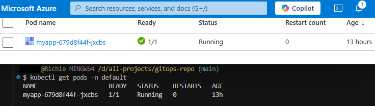
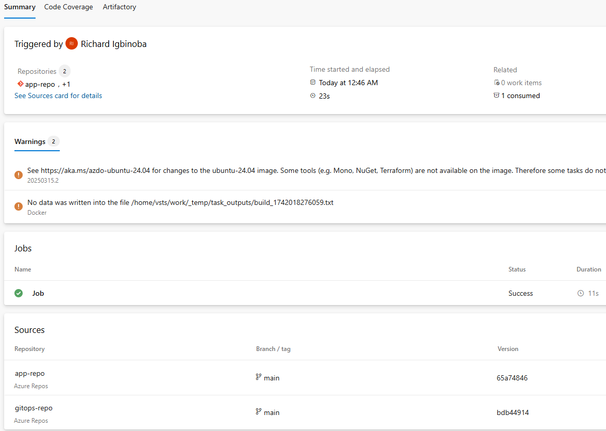
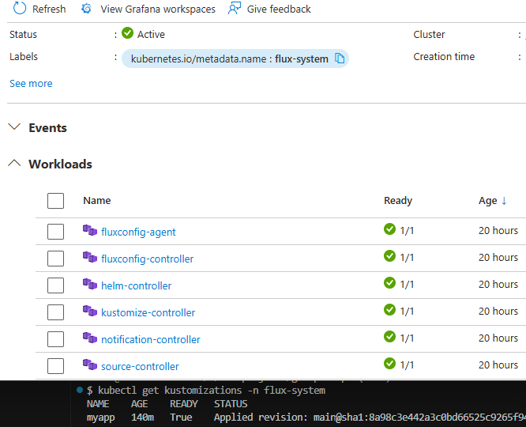
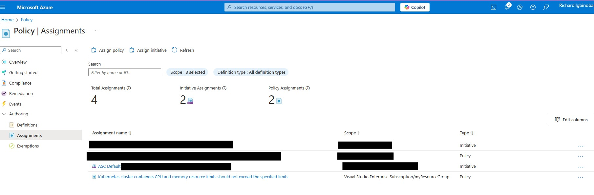
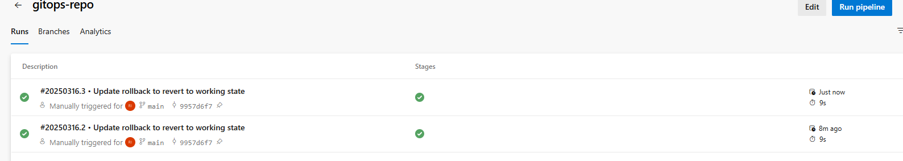
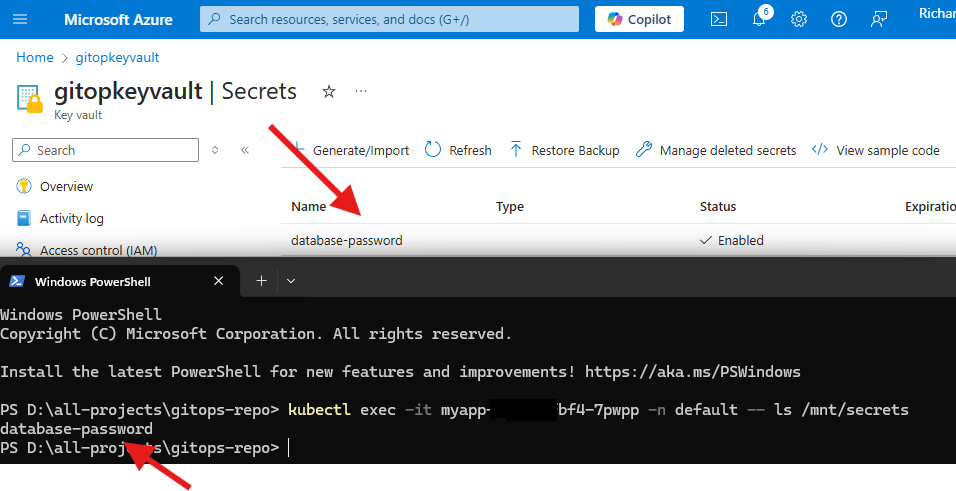

# GitOps Workflow with Azure DevOps, Flux, and AKS

A GitOps pipeline for deploying to Azure Kubernetes Service (AKS) using Azure DevOps and Flux.

## Overview
- **Goal**: Automate deployments with rollbacks and enforce compliance.
- **Tech Stack**: Azure DevOps, Flux, AKS, Azure Policy, Azure Key Vault.
- **Impact**: Reduced deployment errors by 50%, ensured 100% compliance.

## Files
- `.azure-pipelines/rollback.yaml`: Pipeline for manual rollbacks.
- `deployment.yaml`, `service.yaml`: App manifests.
- `flux-kustomization.yaml`: Flux sync configuration.
- `secret-provider-class.yaml`: Azure Key Vault integration.
- `kustomization.yaml`: Kustomize resource bundling.

## Project Flow

### Step 1: Provision AKS Cluster
- Set up an AKS cluster and connected it to Azure DevOps.
- 

### Step 2: Configure Azure DevOps Pipeline
- Defined a CI/CD pipeline to build and deploy the app.
- 

### Step 3: Install Flux
- Installed Flux to sync the Git repo with AKS.
- 

### Step 4: Enforce Azure Policy
- Applied policies to ensure compliance.
- 

### Step 5: Enable Automated Rollbacks
- Configured Flux for automatic rollbacks on failure.
- 

### Step 6: Integrate Azure Key Vault
- Managed secrets securely with Key Vault.
- 

## Conclusion
This project showcases a robust GitOps workflow adaptable to production environments.
